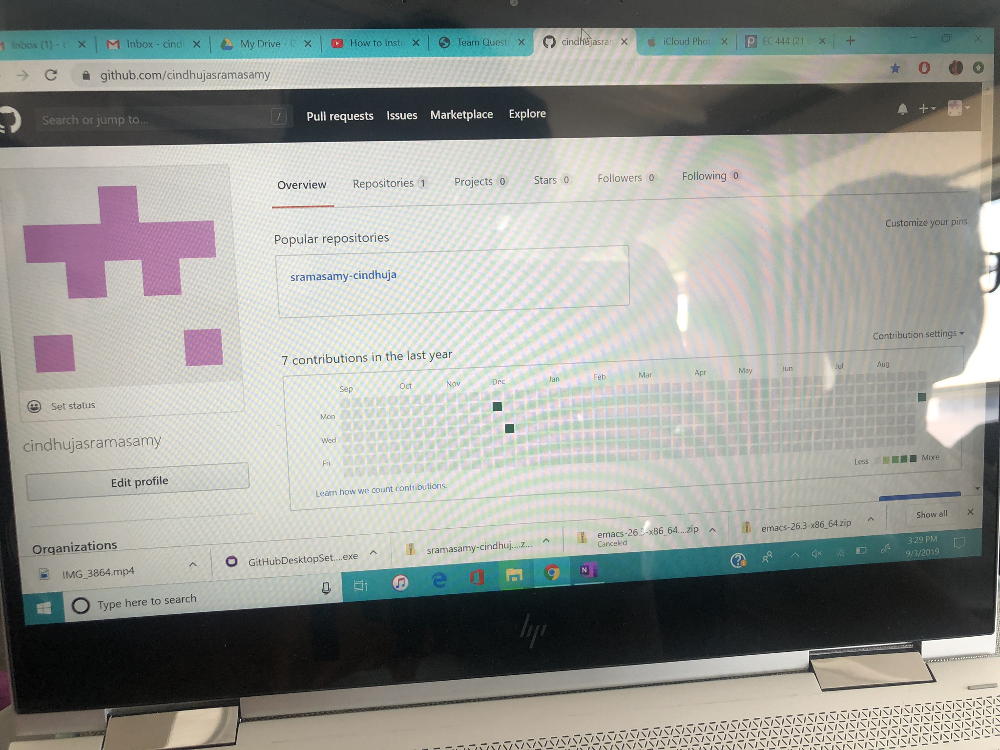

#  Skill Name
Git Hub creation

Author: Cindhuja SRamasamy, 2019-09-03

## Summary
Created a git hub account, downloaded git hub for desktop to clone and push edited files.

## Sketches and Photos

## Modules, Tools, Source Used in Solution

## Supporting Artifacts

-----

## Reminders
- Repo is private
